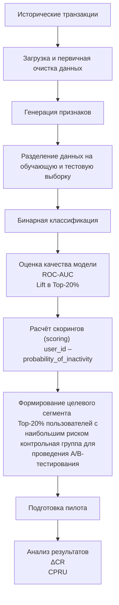

# ML System Design Doc - [RU]
## Дизайн ML системы - Прогнозирование оттока клиентов


### 1. Цели и предпосылки 
#### 1.1. Зачем идем в разработку продукта?  

##### Бизнес-цель  
Снижение уровня оттока клиентов и увеличение доли пользователей, совершающих транзакции в целевом периоде, за счёт предварительного выявления пользователей с высокой вероятностью отсутствия транзакции на основе анализа их поведенческих и транзакционных характеристик и последующего проведения адресных удерживающих мероприятий.

##### Почему станет лучше, чем сейчас, от использования ML 
В текущем процессе удерживающие кампании запускаются после уже зафиксированного снижения активности и строятся на заранее заданных пороговых правилах (например, отстутствие активности в течение N дней), не учитывая особенностей индивидуальной активности пользователя и анализа факторов в совокупности.
Применение ML позволит:
- Достичь более эффективного распределения маркетингового бюджета за счёт концентрации коммуникаций в сегменте повышенного риска.
- Снизить стоимость удержания одного клиента за счёт уменьшения доли нерезультативных контактов.
- Повысить конверсию удерживающих кампаний благодаря точечному воздействию на пользователей с наибольшей вероятностью снижения активности.

##### Что будем считать успехом итерации с точки зрения бизнеса 

###### 1. Экономический эффект
Бизнес-цель предполагает более эффективное использование бюджета. Результат проверяется через изменение стоимости удержания одного клиента:
```math
\text{CPRU} = \frac{\text{маркетинговые затраты}}{\text{количество удержанных пользователей}}
```
маркетинговые затраты — расходы на кампанию (бонусы, коммуникации, скидки),
удержанные пользователи — те, кто совершил транзакцию после воздействия.
Критерий успеха:
снижение CPRU по сравнению с текущим процессом.

###### 2. Рост доли пользователей с транзакцией (снижение оттока)
Измеряется через A/B-тест:
сравнивается конверсия в транзакцию (CR) в ML-сегменте (пользователи, на которых применяем модель) и контрольной группе (пользователи, на которых модель не используется);
рассчитывается относительное улучшение:
```math
\Delta CR = \frac{\Delta CR_{ml} - \Delta CR_{control}}{\Delta CR_{control}}
```
где:
- $CR$ (Conversion Rate) — доля пользователей, совершивших транзакцию
- $\Delta CR_{ml}$ — изменение CR в экспериментальной группе (с моделью)
- $\Delta CR_{control}$ — изменение CR в контрольной группе
Критерий успеха:
```math
\Delta CR \geq 5\%
```
Поскольку отток определяется как отсутствие транзакции, рост CR эквивалентен снижению уровня оттока.

#### 1.2. Бизнес-требования и ограничения  

##### Краткое описание БТ 
- Функциональное назначение системы.
Система должна обеспечивать расчёт индивидуальной вероятности отсутствия транзакции в целевом периоде для каждого пользователя на основании его поведенческих и транзакционных характеристик за заданный период.

- Формирование целевого сегмента.
На основании рассчитанных вероятностей система должна:
ранжировать пользователей по уровню риска;
формировать целевой сегмент фиксированного размера;
передавать сформированный сегмент в маркетинговый контур для проведения удерживающих мероприятий.

- Измеримость результата.
Система должна обеспечивать возможность проведения A/B-тестирования и последующей оценки:
конверсии в транзакцию (CR);
экономических показателей (CPRU).

##### Бизнес-ограничения   
- Ограниченность исторических данных.
Для построения модели используются только поведенческие и транзакционные данные за период январь–ноябрь 2025 года. Использование внешних источников данных или дополнительных пользовательских характеристик не предполагается. При внедрении в продуктивную среду модель может быть переобучена на актуальных данных.

- Фиксированный целевой период.
Прогноз формируется для конкретного горизонта — декабрь 2025 года. Изменение горизонта прогнозирования в рамках текущей итерации не предусмотрено.

- Ограничение размера целевого сегмента.
Маркетинговые ресурсы ограничены, поэтому размер сегмента воздействия фиксирован (например, Top-20% пользователей с наибольшим риском). Модель не должна приводить к увеличению общего объёма коммуникаций.

- Требование экономической целесообразности.
Внедрение модели допускается только при подтверждённом положительном или нейтральном экономическом эффекте (снижение CPRU). При отсутствии бизнес-эффекта масштабирование решения не осуществляется.

##### Что мы ожидаем от конкретной итерации 
В рамках текущей итерации ожидается создание и пилотная проверка ML-механизма ранжирования пользователей по риску отсутствия транзакции в декабре 2025 года.
Ожидаемые результаты итерации:
1. Подготовка данных и построение модели.
формирование обучающей выборки на основе данных за январь–ноябрь 2025 года;
обучение модели бинарной классификации с расчётом индивидуальной вероятности отсутствия транзакции.
2. Формирование целевого сегмента.
ранжирование всей пользовательской базы по рассчитанной вероятности;
выделение сегмента фиксированного размера;
подготовка сегмента для передачи в маркетинговую систему.

##### Описание бизнес-процесса пилота, насколько это возможно - как именно мы будем использовать модель в существующем бизнес-процессе?
В рамках пилотной итерации модель встраивается в текущий процесс запуска удерживающих кампаний без изменения его общей логики, но с заменой механизма формирования целевого сегмента.
1. Формирование входных данных.
До запуска кампании формируется набор признаков на основании поведенческих и транзакционных данных пользователей за заданный временной промежуток. Используются только данные, доступные в рамках действующего контура.

2. Расчёт скорингов.
Обученная ML-модель применяется ко всей активной пользовательской базе.
Для каждого пользователя рассчитывается вероятность отсутствия транзакции в декабре.
Результатом этапа является таблица вида:
user_id – probability_of_inactivity – rank.

3. Ранжирование и формирование сегментов.
Пользователи сортируются по убыванию вероятности отсутствия транзакции.
Далее:
формируется ML-сегмент фиксированного размера;
формируется контрольная группа.

4. Передача сегментов в маркетинговый контур.
Сформированные списки пользователей передаются в существующую систему коммуникаций.
Механика кампании (тип предложения, канал коммуникации, бюджет) остаётся неизменной — меняется только способ отбора аудитории.

5. Проведение удерживающей кампании.
Коммуникации запускаются в стандартном режиме.
Дополнительные изменения в операционном процессе не вносятся.

6. Сбор результатов и анализ.
По завершении целевого периода проводится оценка:
- доли пользователей с ≥1 транзакцией;
- уровня оттока;
- экономических показателей (CPRU);

##### Что считаем успешным пилотом? Критерии успеха и возможные пути развития проекта
```math
\Delta CR \geq 0.05
```

```math
CPRU_{ML} \leq CPRU_{control}
```
Успешный пилот — это пилот, в котором на >50% сегментов наблюдается измеримое улучшение ключевых бизнес-метрик удержания по сравнению с текущим подходом. Улучшение достигается при управляемой частоте нерезультативных контактов и без превышения маркетингового бюджета. Система стабильно воспроизводится на новых данных, интегрируется в текущий процесс кампаний и формирует отчёты, пригодные для анализа и принятия решений.

#### 1.3. Что входит в скоуп проекта/итерации, что не входит   

##### На закрытие каких БТ подписываемся в данной итерации    
- Подготовка обучающей выборки на основе поведенческих и транзакционных данных за январь–ноябрь 2025 года.

- Разработка и обучение модели бинарной классификации для расчета вероятности отсутствия транзакции ($p_i$) в декабре 2025 года для каждого активного пользователя.

- Ранжирование базы по уровню риска и формирование целевого сегмента фиксированного размера (Top-20%).

- Оценка качества ранжирования по согласованным ML-метрикам (ROC-AUC $\geq$ 0.70, Lift в Top-20% $\geq$ 1.5).

##### Что не будет закрыто  
- Обогащение выборки внешними источниками данных или дополнительными характеристиками, выходящими за рамки доступных данных за январь–ноябрь 2025 года.

- Прогнозирование вероятности оттока на другие временные горизонты (отличные от декабря 2025 года).

- Выбор каналов коммуникации, распределение маркетингового бюджета и формирование самих предложений для удержания (остается на стороне маркетингового контура).

- Финальный расчет изменения конверсии ($\Delta CR$) и экономического эффекта (CPRU) - это проводится после завершения кампании по результатам A/B-теста.

##### Описание результата с точки зрения качества кода и воспроизводимости решения 
Воспроизводимый пайплайн, обеспечивающий прозрачную для бизнес-пользователей логику обработки исторических данных, обучения модели и выдачи скорингов. Решение должно стабильно воспроизводиться на новых данных для обеспечения возможности регулярного пересчета вероятностей в рамках существующих операционных циклов запуска кампаний. Сформированные списки передаются строго в виде `user_id` – `probability_of_inactivity` – `rank`.

##### Описание планируемого технического долга (что оставляем для дальнейшей продуктивизации)   
Автоматизация регулярного пересчета скорингов без ручного запуска. В текущей итерации фокус сделан на пилотной проверке бизнес-эффекта; масштабирование решения и глубокая автоматизация процесса (MLOps) будут целесообразны только при подтвержденном снижении CPRU по итогам пилота.

#### 1.4. Предпосылки решения  

##### Описание всех общих предпосылок решения, используемых в системе – с обоснованием от запроса бизнеса: какие блоки данных используем, горизонт прогноза, гранулярность модели, и др.  
- **Блоки данных:** Используем исключительно внутренние поведенческие и транзакционные характеристики пользователей. *Обоснование:* бизнес-ограничение на использование только доступных в действующем контуре данных.

- **Исторический период для обучения:** Данные с января по ноябрь 2025 года. *Обоснование:* необходимость собрать достаточное количество паттернов активности до наступления целевого периода.

- **Горизонт прогноза:** Декабрь 2025 года. *Обоснование:* зафиксированный целевой период пилотной кампании по удержанию.

- **Гранулярность модели:** Прогноз строится индивидуально для каждого клиента (на уровне уникального идентификатора `user_id`). *Обоснование:* требование бизнеса к точечному воздействию и персонализации удерживающих мероприятий.

- **Целевая переменная:** Бинарная ($y=0$ — совершил $\geq 1$ транзакцию, $y=1$ — не совершил транзакцию). *Обоснование:* прямая связь с определением оттока в рамках бизнес-цели.

- **Размер целевого сегмента:** Фиксированный топ пользователей (Top-20%). *Обоснование:* жесткое ограничение маркетингового бюджета и недопустимость увеличения общего объема коммуникаций.

- **Режим применения:** Оффлайн-скоринг (batch) до запуска декабрьской кампании. *Обоснование:* решение должно встраиваться в существующий процесс без изменения общей логики запуска коммуникаций и не требует реакции на действия пользователя в реальном времени. 

## 2. Методология (Data Scientist)

### 2.1. Постановка задачи
С технической точки зрения решается задача бинарной классификации и ранжирования пользователей по риску отсутствия транзакции в целевом периоде.

- **Целевой признак**
    Целевой переменной является факт совершения транзакции в целевом периоде.

    y = 0 — пользователь совершил хотя бы одну транзакцию в целевом периоде;
    y = 1 — пользователь не совершил транзакций (потенциальный отток).

- **Что делает модель:**

    Модель рассчитывает вероятность отсутствия транзакционной активности для каждого пользователя на основе:
    - агрегированных характеристик транзакций (суммы, частота, статистики операций),
    - поведенческих признаков активности (частота операций, интервалы между транзакциями),
    - временных характеристик использования сервиса (давность последней активности, динамика активности).

    Результат работы модели — числовой риск-скор (probability score), отражающий вероятность того, что пользователь перестанет совершать транзакции.

- **Формализация задачи**

    Пусть:
    - $X_i$ — вектор признаков пользователя, сформированный на основе его транзакционной истории
    - $y_i$ — бинарная метка оттока.

    Необходимо построить функцию:

    ```math
    f(X_i) \rightarrow P(y=1 \mid X_i)
    ```

    где 
    ```math
    P(y=1 \mid X_i)
    ``` 
    — предсказанная вероятность того, что пользователь прекратит совершать транзакции в целевом периоде.

- **Основная цель модели** — рассчитывать вероятность отсутствия транзакции для каждого пользователя в целевом периоде, после чего пользователи сортируются по убыванию этой вероятности и формируется сегмент повышенного риска.
Результат работы модели используется для формирования целевого сегмента фиксированного размера (например, Top-20% пользователей), на который направляются удерживающие маркетинговые коммуникации.

### 2.2. Блок-схема решения
Блок-схема решения отражает полный технический процесс построения и применения ML-модели прогнозирования оттока клиентов — от подготовки данных до формирования сегмента пользователей для удерживающей кампании. Схема включает архитектуру MVP.


