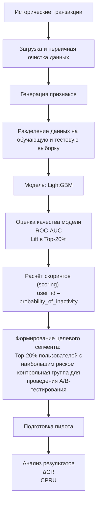

# ML System Design Doc - [RU]
## Дизайн ML системы - Прогнозирование оттока клиентов


### 1. Цели и предпосылки 
#### 1.1. Зачем идем в разработку продукта?  

##### Бизнес-цель  
Снижение уровня оттока клиентов и увеличение доли пользователей, совершающих транзакции в целевом периоде, за счёт предварительного выявления пользователей с высокой вероятностью отсутствия транзакции на основе анализа их поведенческих и транзакционных характеристик и последующего проведения адресных удерживающих мероприятий.

##### Почему станет лучше, чем сейчас, от использования ML 
В текущем процессе удерживающие кампании строятся на заранее заданных пороговых правилах (например, отстутствие активности в течение N дней), не учитывая особенностей индивидуальной активности пользователя и анализа факторов в совокупности.
Применение ML позволит:
- Достичь более эффективного распределения маркетингового бюджета за счёт концентрации коммуникаций в сегменте повышенного риска.
- Снизить стоимость удержания одного клиента за счёт уменьшения доли нерезультативных контактов.
- Повысить конверсию удерживающих кампаний благодаря точечному воздействию на пользователей с наибольшей вероятностью снижения активности.

##### Что будем считать успехом итерации с точки зрения бизнеса 

###### 1. Экономический эффект
Бизнес-цель предполагает более эффективное использование бюджета. Результат проверяется через изменение стоимости удержания одного клиента:
```math
\text{CPRU} = \frac{\text{маркетинговые затраты}}{\text{количество удержанных пользователей}}
```
маркетинговые затраты — расходы на кампанию (бонусы, коммуникации, скидки),
удержанные пользователи — те, кто совершил транзакцию после воздействия.
Критерий успеха:
снижение CPRU по сравнению с текущим процессом.

###### 2. Рост доли пользователей с транзакцией (снижение оттока)
Измеряется через A/B-тест:
сравнивается конверсия в транзакцию (CR) в ML-сегменте (пользователи, на которых применяем модель) и контрольной группе (пользователи, на которых модель не используется);
рассчитывается относительное улучшение:
```math
\Delta CR = \frac{\Delta CR_{ml} - \Delta CR_{control}}{\Delta CR_{control}}
```
где:
- $CR$ (Conversion Rate) — доля пользователей, совершивших транзакцию
- $\Delta CR_{ml}$ — изменение CR в экспериментальной группе (с моделью)
- $\Delta CR_{control}$ — изменение CR в контрольной группе
Критерий успеха:
```math
\Delta CR \geq 5\%
```

#### 1.2. Бизнес-требования и ограничения  

##### Краткое описание БТ 
- Функциональное назначение системы.
Система должна обеспечивать расчёт индивидуальной вероятности отсутствия транзакции в целевом периоде для каждого пользователя на основании его поведенческих и транзакционных характеристик за заданный период.

- Формирование целевого сегмента.
На основании рассчитанных вероятностей система должна:
ранжировать пользователей по уровню риска;
формировать целевой сегмент фиксированного размера;
передавать сформированный сегмент в маркетинговый контур для проведения удерживающих мероприятий.

- Измеримость результата.
Система должна обеспечивать возможность проведения A/B-тестирования и последующей оценки:
конверсии в транзакцию (CR);
экономических показателей (CPRU).

##### Бизнес-ограничения   
- Исключительность транзакционных данных.
Модель строится как общее решение, работающее только с финансовыми потоками. 

- Ограниченность исторических данных.
Для построения модели используются только поведенческие и транзакционные данные за период январь–ноябрь 2025 года. Использование внешних источников данных или дополнительных пользовательских характеристик не предполагается. При внедрении в продуктивную среду модель может быть переобучена на актуальных данных.

- Фиксированный целевой период.
Прогноз формируется для конкретного горизонта — декабрь 2025 года. Изменение горизонта прогнозирования в рамках текущей итерации не предусмотрено.

- Ограничение размера целевого сегмента.
Маркетинговые ресурсы ограничены, поэтому размер сегмента воздействия фиксирован (например, Top-20% пользователей с наибольшим риском). Модель не должна приводить к увеличению общего объёма коммуникаций.

- Требование экономической целесообразности.
Внедрение модели допускается только при подтверждённом положительном экономическом эффекте (снижение CPRU). При отсутствии бизнес-эффекта масштабирование решения не осуществляется.

##### Что мы ожидаем от конкретной итерации 
В рамках текущей итерации ожидается создание и пилотная проверка ML-механизма ранжирования пользователей по риску отсутствия транзакции в декабре 2025 года.
Ожидаемые результаты итерации:
1. Подготовка данных и построение модели.
- формирование обучающей выборки на основе данных за январь–ноябрь 2025 года;
- обучение модели бинарной классификации с расчётом индивидуальной вероятности отсутствия транзакции.
2. Формирование целевого сегмента.
- ранжирование всей пользовательской базы по рассчитанной вероятности;
- выделение сегмента фиксированного размера;
- подготовка сегмента для передачи в маркетинговую систему.

##### Описание бизнес-процесса пилота, насколько это возможно - как именно мы будем использовать модель в существующем бизнес-процессе?
В рамках пилотной итерации модель встраивается в текущий процесс запуска удерживающих кампаний без изменения его общей логики, но с заменой механизма формирования целевого сегмента.
1. Формирование входных данных.
До запуска кампании формируется набор признаков на основании поведенческих и транзакционных данных пользователей за заданный временной промежуток. Используются только данные, доступные в рамках действующего контура.

2. Расчёт скорингов.
Обученная ML-модель применяется ко всей активной пользовательской базе.
Для каждого пользователя рассчитывается вероятность отсутствия транзакции в декабре.
Результатом этапа является таблица вида:
user_id – probability_of_inactivity – rank.

3. Ранжирование и формирование сегментов.
Пользователи сортируются по убыванию вероятности отсутствия транзакции.
Далее:
формируется ML-сегмент фиксированного размера;
формируется контрольная группа.

4. Передача сегментов в маркетинговый контур.
Сформированные списки пользователей передаются в существующую систему коммуникаций.
Механика кампании (тип предложения, канал коммуникации, бюджет) остаётся неизменной — меняется только способ отбора аудитории.

5. Проведение удерживающей кампании.
Коммуникации запускаются в стандартном режиме.
Дополнительные изменения в операционном процессе не вносятся.

6. Сбор результатов и анализ.
По завершении целевого периода проводится оценка:
- доли пользователей с ≥1 транзакцией;
- уровня оттока;
- экономических показателей (CPRU);

##### Что считаем успешным пилотом? Критерии успеха и возможные пути развития проекта
```math
\Delta CR \geq 0.05
```

```math
CPRU_{ML} \leq CPRU_{control}
```
Успешный пилот — это пилот, в котором наблюдается измеримое улучшение ключевых бизнес-метрик удержания по сравнению с текущим подходом. Улучшение достигается при управляемой частоте нерезультативных контактов и без превышения маркетингового бюджета. Система стабильно воспроизводится на новых данных, интегрируется в текущий процесс кампаний и формирует отчёты, пригодные для анализа и принятия решений.

#### 1.3. Что входит в скоуп проекта/итерации, что не входит   

##### На закрытие каких БТ подписываемся в данной итерации    
- Подготовка обучающей выборки. 
Формирование витрины данных на основе поведенческих и транзакционных логов пользователей за период январь–ноябрь 2025 года.

- Разработка прогнозного механизма.
Обучение модели бинарной классификации для расчета индивидуальной вероятности отсутствия транзакции в целевом периоде (декабрь 2025 года).

- Формирование целевого сегмента.
Ранжирование всей базы по уровню риска и выделение сегмента фиксированного размера (Top-20% пользователей с наибольшим риском).

- Подготовка к пилоту.
Создание структуры данных для проведения A/B-тестирования.

##### Что не будет закрыто  
- Внешнее обогащение.
Использование данных из внешних источников или характеристик, выходящих за рамки доступного контура за 2025 год.

- Масштабирование горизонта.
Прогнозирование вероятности оттока на другие временные горизонты (отличные от декабря 2025 года).

- Операционный маркетинг.
Выбор каналов коммуникации, распределение маркетингового бюджета и формирование самих предложений для удержания (остается на стороне маркетингового контура).

- Пост-аналитика.
Финальный расчет фактического изменения конверсии ($\Delta CR$) и экономического эффекта ($CPRU$) - данные показатели замеряются только после завершения кампании по результатам A/B-теста.

##### Описание результата с точки зрения качества кода и воспроизводимости решения 
Воспроизводимый пайплайн, обеспечивающий прозрачную для бизнес-пользователей логику обработки исторических данных, обучения модели и выдачи скорингов. Решение должно стабильно воспроизводиться на новых данных для обеспечения возможности регулярного пересчета вероятностей в рамках существующих операционных циклов запуска кампаний. Сформированные списки передаются строго в виде `user_id` – `probability_of_inactivity` – `rank`.

##### Описание планируемого технического долга (что оставляем для дальнейшей продуктивизации)   
Автоматизация регулярного пересчета скорингов без ручного запуска. В текущей итерации фокус сделан на пилотной проверке бизнес-эффекта; масштабирование решения и глубокая автоматизация процесса будут целесообразны только при подтвержденном снижении CPRU по итогам пилота.

#### 1.4. Предпосылки решения  

##### Описание всех общих предпосылок решения, используемых в системе – с обоснованием от запроса бизнеса.  
- **Блоки данных:** Используем исключительно внутренние поведенческие и транзакционные характеристики пользователей. *Обоснование:* бизнес-ограничение на использование только доступных в действующем контуре данных.

- **Исторический период для обучения:** Данные с января по ноябрь 2025 года. *Обоснование:* необходимость собрать достаточное количество паттернов активности до наступления целевого периода.

- **Горизонт прогноза:** Декабрь 2025 года. *Обоснование:* зафиксированный целевой период пилотной кампании по удержанию.

- **Гранулярность модели:** Прогноз строится индивидуально для каждого клиента (на уровне уникального идентификатора `user_id`). *Обоснование:* требование бизнеса к точечному воздействию на клиентов.

- **Целевая переменная:** Бинарная ($y=0$ — совершил $\geq 1$ транзакцию, $y=1$ — не совершил транзакцию). *Обоснование:* прямая связь с определением оттока в рамках бизнес-цели.

- **Размер целевого сегмента:** Фиксированный топ пользователей (Top-20%). *Обоснование:* ограниченность маркетингового бюджета и требование не увеличивать общий объем коммуникаций.

- **Режим применения:** Оффлайн-скоринг (batch) до запуска декабрьской кампании. *Обоснование:* решение встраивается в текущий процесс запуска кампаний и не требует реакции на действия пользователя в режиме реального времени. 

- **Типизация данных:** Транзакционный поток является исчерпывающим источником для определения лояльности. *Обоснование:* Такой подход делает решение «общим» — его можно масштабировать на любой продукт внутри экосистемы. 

## 2. Методология (Data Scientist)

### 2.1. Постановка задачи
С технической точки зрения решается задача бинарной классификации и ранжирования пользователей по риску отсутствия транзакции в целевом периоде.

- **Целевой признак**

    Целевой переменной является факт совершения транзакции в целевом периоде $y$.

    - $y = 0$ — пользователь совершил хотя бы одну транзакцию в целевом периоде;
    - $y = 1$ — пользователь не совершил транзакций (потенциальный отток).

- **Что делает модель:**

    Модель рассчитывает вероятность отсутствия транзакционной активности для каждого пользователя на основе:
    - агрегированных характеристик транзакций (суммы, частота, статистики операций),
    - поведенческих признаков активности (частота операций, интервалы между транзакциями),
    - временных характеристик использования сервиса (давность последней активности, динамика активности).

    Результат работы модели — числовой риск-скор (probability score), отражающий вероятность того, что пользователь перестанет совершать транзакции.

- **Формализация задачи**

    Пусть:
    - $X_i$ — вектор признаков пользователя, сформированный на основе его транзакционной истории
    - $y_i$ — бинарная метка оттока.

    Необходимо построить функцию:

```math
f(X_i) \rightarrow P(y=1 \mid X_i)
```

где 
```math
    P(y=1 \mid X_i)
``` 
— предсказанная вероятность того, что пользователь прекратит совершать транзакции в целевом периоде.

- **Основная цель модели** — рассчитывать вероятность отсутствия транзакции для каждого пользователя в целевом периоде, после чего пользователи сортируются по убыванию этой вероятности и формируется сегмент повышенного риска.
Результат работы модели используется для формирования целевого сегмента фиксированного размера (например, Top-20% пользователей), на который направляются удерживающие маркетинговые коммуникации.

### 2.2. Блок-схема решения
Блок-схема решения отражает полный технический процесс построения и применения ML-модели прогнозирования оттока клиентов — от подготовки данных до формирования сегмента пользователей для удерживающей кампании. Схема включает архитектуру MVP.



### 2.3. Этапы решения задачи Data Scientist
Проектирование решения разбито на логические этапы: от формирования витрины данных до подготовки инфраструктуры для проведения пилотного A/B-тестирования.

#### Этап 1 — Подготовка данных и проектирование витрины
На данном этапе планируется агрегация сырых транзакционных логов в профили пользователей. Для обучения будут использованы данные за период январь–ноябрь 2025 года.

**Данные и валидация:**
| Компонент данных | Источник формирования | Функциональное назначение | Контроль качества |
| :--- | :--- | :--- | :--- |
| **Транзакционный поток** (`amount`, `date`) | Входной датасет `train_data.csv` | Генерация признаков активности и расчет временных агрегатов | Валидация типов данных, проверка хронологии событий, фильтрация аномальных сумм |
| **Вектор целевых меток** (`churn`) | Поле `churn` (исторический отток) | Формирование обучающего сигнала и расчет бизнес-метрик (Lift, $\Delta CR$) | Анализ дисбаланса классов |
| **Поведенческие дескрипторы** | Feature Engineering Pipeline | Реализация логики MVP: `income_share`, `weekend_ratio` и метрики Recency | Проверка распределений, устранение мультиколлинеарности в перекрывающихся окнах |
| **Служебные параметры** (Split, Weights) | Процесс препроцессинга | Обеспечение репрезентативности выборок | Контроль Random State, исключение пересечения пользователей (User Overlap) между выборками | 

**Результат этапа.** 
Сформированная аналитическая витрина данных (Feature Store) на уровне user_id


#### Этап 2 — Разработка прогнозных моделей 
**1. Формирование выборки:**
- **Техника.** Разделение данных на Train и Test 80/20 с применением стратификации по целевой переменной `churn`.
- **Горизонт и гранулярность.** Прогноз будет формироваться на декабрь 2025 года индивидуально для каждого `user_id`.

**2. Техника решения:**
- **Baseline:**
    * **Признаки.** Использование простых статистик по сумме (`amount`) и количеству операций за весь доступный период.
    * **Алгоритм.** Логистическая регрессия (для оценки базового качества разделения классов).
- **MVP (Целевое решение):**
    * **Feature Engineering.** Создание признаков на основе скользящих окон (**30, 60 и 90 дней**). Это позволит модели учитывать динамику затухания или роста активности. 
    * **Проектируемые метрики.** `income_share` (доля входящих транзакций), `weekend_ratio` (индекс активности в выходные), `days_since_last_transaction` (время с момента последней операции).
    * **Алгоритм.** **LightGBM** (градиентный бустинг). Выбор обоснован способностью алгоритма эффективно обрабатывать дисбаланс классов и нелинейные зависимости.

**3. Метрики качества:**
- **Связь с бизнесом:** Ключевой индикатор успеха — **Lift в Top-20% $\ge 1.5$**. Это требование закладывается для обеспечения концентрации целевой аудитории в сегменте воздействия.
- **Техническая метрика:** **ROC-AUC $\ge 0.70$**. Метрика необходима для проверки качества ранжирования пользователей по степени риска.

**4. Риски и митигация:**
- **Риск:** Сильная взаимосвязь (дублирование) признаков. Так как данные за 30, 60 и 90 дней перекрывают друг друга, модель может получать избыточную информацию.
- **Митигация:** Использование модели LightGBM, которая устойчива к повторяющимся признакам, и дополнительный отбор самых важных факторов (Feature Importance) перед финальным обучением.

#### Этап 3 — Подготовка инференса и интеграция бизнес-правил
- **Описание техники:** Создание скрипта для автоматизированного применения обученной модели к новым данным. На выходе должна формироваться таблица: `user_id` – `probability_of_inactivity` – `rank`.
- **Бизнес-проверка:** Реализация логики пост-фильтрации (исключение из целевого сегмента сотрудников и спец. счетов согласно требованиям Product Owner).
- **Необходимый результат:** Готовый к интеграции в маркетинговый контур список Top-20% наиболее рисковых пользователей для запуска пилота.

## 3. Подготовка пилота

### 3.1. Способ оценки пилота

**Дизайн эксперимента (Offline Replay):**
Для оценки эффективности модели используется выборка за декабрь 2025 года. Сравнение производится между двумя стратегиями формирования целевого сегмента:
* **Контрольная группа (Baseline):** Имитация текущего процесса отбора пользователей на основе статических бизнес-правил (например, отсутствие транзакций в течение последних $N$ дней).
* **Тестовая группа (ML Strategy):** Отбор пользователей на основе рассчитанного риск-скора. В сегмент воздействия попадает **Top-20%** пользователей с наивысшим рангом в списке.
* **Метод валидации:** Сопоставление фактической конверсии в транзакцию ($CR$) в целевом периоде (декабрь 2025).

**Целевой формат (Online Roadmap):**
* **Рандомизация:** Хеширование `user_id` для стабильного разделения трафика.
* **Длительность:** 1 отчетный месяц (полный транзакционный цикл).
* **Изоляция:** Закрепление пользователя за группой на весь период эксперимента для исключения «сетевых эффектов».

### 3.2. Что считаем успешным пилотом

Успех пилота определяется через достижение целевых порогов по бизнес-индикаторам и соблюдение технических SLA.

#### Бизнес-метрики (Product Owner)
1.  **Относительный прирост активности ($\Delta CR \ge 5\%$):** Увеличение доли активных пользователей в ML-сегменте относительно контроля.
2.  **Экономическая эффективность ($CPRU_{ML} \le CPRU_{Control}$):** Снижение удельных затрат на одно успешное удержание за счет минимизации нецелевых коммуникаций.
3.  **Концентрация целевой аудитории ($Lift \text{ @ } Top\text{-}20\% \ge 1.5$):** Подтверждение способности модели приоритизировать пользователей с максимальным риском оттока.

#### Технические метрики (Data Scientist)
1.  **Качество ранжирования ($ROC\text{-}AUC \ge 0.70$):** Стабильность разделяющей способности модели на новых данных.
2.  **Точность сегментации ($Precision \text{ @ } Top\text{-}20\% \ge 0.65$):** Доля корректно предсказанных событий оттока в целевом сегменте.
3.  **Batch SLA:** Время формирования полного реестра прогнозов на всей клиентской базе не должно превышать 2-х часов на стандартных мощностях.

### 3.3. Подготовка пилота (Ресурсы и ограничения)

**Вычислительная сложность:**
* **Алгоритм:** Использование **LightGBM** позволяет минимизировать затраты на обучение за счет гистограммного метода построения деревьев. Обучение и инференс проводятся в **Batch-режиме**, что исключает необходимость в GPU-инфраструктуре.
* **Ресурсный лимит:** На текущем объеме транзакционных данных (январь–ноябрь) потребление RAM ограничено 8-16 ГБ. Архитектура признаков оптимизирована для быстрой агрегации в памяти.

**Технические артефакты:**
1.  **Сериализация:** Модель и параметры препроцессинга сохраняются как единый пайплайн (`joblib/pickle`) для обеспечения воспроизводимости признаков.
2.  **Пост-фильтрация:** Реализован программный модуль исключения спец. счетов и сотрудников из итогового реестра согласно бизнес-ограничениям (исключение из целевого сегмента по требованию Product Owner).
3.  **Формат выдачи:** Результат формируется в виде защищенной таблицы: `user_id` – `probability_of_inactivity` – `rank`.

**План митигации рисков:**
В рамках MVP мы ограничиваемся транзакционным «агностик-подходом» (анализ поведения без привлечения персональных данных). Дальнейшее масштабирование и автоматизация переобучения признаются целесообразными только при подтверждении статистически значимого снижения $CPRU$ по итогам текущей итерации.