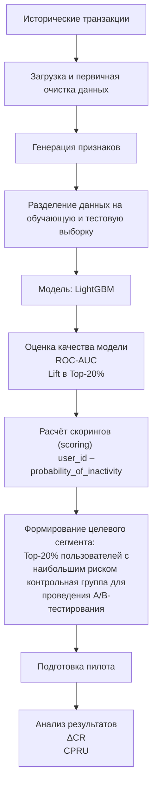

# ML System Design Doc - [RU]
## Дизайн ML системы - Прогнозирование оттока клиентов


### 1. Цели и предпосылки 
#### 1.1. Зачем идем в разработку продукта?  

##### Бизнес-цель  
Снижение уровня оттока клиентов и увеличение доли пользователей, совершающих транзакции в целевом периоде, за счёт предварительного выявления пользователей с высокой вероятностью отсутствия транзакции на основе анализа их поведенческих и транзакционных характеристик и последующего проведения адресных удерживающих мероприятий.

##### Почему станет лучше, чем сейчас, от использования ML 
В текущем процессе удерживающие кампании строятся на заранее заданных пороговых правилах (например, отстутствие активности в течение N дней), не учитывая особенностей индивидуальной активности пользователя и анализа факторов в совокупности.
Применение ML позволит:
- Достичь более эффективного распределения маркетингового бюджета за счёт концентрации коммуникаций в сегменте повышенного риска.
- Снизить стоимость удержания одного клиента за счёт уменьшения доли нерезультативных контактов.
- Повысить конверсию удерживающих кампаний благодаря точечному воздействию на пользователей с наибольшей вероятностью снижения активности.

##### Что будем считать успехом итерации с точки зрения бизнеса 

###### 1. Экономический эффект
Бизнес-цель предполагает более эффективное использование бюджета. Результат проверяется через изменение стоимости удержания одного клиента:
```math
\text{CPRU} = \frac{\text{маркетинговые затраты}}{\text{количество удержанных пользователей}}
```
маркетинговые затраты — расходы на кампанию (бонусы, коммуникации, скидки),
удержанные пользователи — те, кто совершил транзакцию после воздействия.
Критерий успеха:
снижение CPRU по сравнению с текущим процессом.

###### 2. Рост доли пользователей с транзакцией (снижение оттока)
Измеряется через A/B-тест:
сравнивается конверсия в транзакцию (CR) в ML-сегменте (пользователи, на которых применяем модель) и контрольной группе (пользователи, на которых модель не используется);
рассчитывается относительное улучшение:
```math
\Delta CR = \frac{\Delta CR_{ml} - \Delta CR_{control}}{\Delta CR_{control}}
```
где:
- $CR$ (Conversion Rate) — доля пользователей, совершивших транзакцию
- $\Delta CR_{ml}$ — изменение CR в экспериментальной группе (с моделью)
- $\Delta CR_{control}$ — изменение CR в контрольной группе
Критерий успеха:
```math
\Delta CR \geq 5\%
```

#### 1.2. Бизнес-требования и ограничения  

##### Краткое описание БТ 
- Функциональное назначение системы.
Система должна обеспечивать расчёт индивидуальной вероятности отсутствия транзакции в целевом периоде для каждого пользователя на основании его поведенческих и транзакционных характеристик за заданный период.

- Формирование целевого сегмента.
На основании рассчитанных вероятностей система должна:
ранжировать пользователей по уровню риска;
формировать целевой сегмент фиксированного размера;
передавать сформированный сегмент в маркетинговый контур для проведения удерживающих мероприятий.

- Измеримость результата.
Система должна обеспечивать возможность проведения A/B-тестирования и последующей оценки:
конверсии в транзакцию (CR);
экономических показателей (CPRU).

##### Бизнес-ограничения   
- Исключительность транзакционных данных.
Модель строится как общее решение, работающее только с финансовыми потоками. 

- Ограниченность исторических данных.
Для построения модели используются только поведенческие и транзакционные данные за период январь–ноябрь 2025 года. Использование внешних источников данных или дополнительных пользовательских характеристик не предполагается. При внедрении в продуктивную среду модель может быть переобучена на актуальных данных.

- Фиксированный целевой период.
Прогноз формируется для конкретного горизонта — декабрь 2025 года. Изменение горизонта прогнозирования в рамках текущей итерации не предусмотрено.

- Ограничение размера целевого сегмента.
Маркетинговые ресурсы ограничены, поэтому размер сегмента воздействия фиксирован (например, Top-20% пользователей с наибольшим риском). Модель не должна приводить к увеличению общего объёма коммуникаций.

- Требование экономической целесообразности.
Внедрение модели допускается только при подтверждённом положительном экономическом эффекте (снижение CPRU). При отсутствии бизнес-эффекта масштабирование решения не осуществляется.

##### Что мы ожидаем от конкретной итерации 
В рамках текущей итерации ожидается создание и пилотная проверка ML-механизма ранжирования пользователей по риску отсутствия транзакции в декабре 2025 года.
Ожидаемые результаты итерации:
1. Подготовка данных и построение модели.
- формирование обучающей выборки на основе данных за январь–ноябрь 2025 года;
- обучение модели бинарной классификации с расчётом индивидуальной вероятности отсутствия транзакции.
2. Формирование целевого сегмента.
- ранжирование всей пользовательской базы по рассчитанной вероятности;
- выделение сегмента фиксированного размера;
- подготовка сегмента для передачи в маркетинговую систему.

##### Описание бизнес-процесса пилота, насколько это возможно - как именно мы будем использовать модель в существующем бизнес-процессе?
В рамках пилотной итерации модель встраивается в текущий процесс запуска удерживающих кампаний без изменения его общей логики, но с заменой механизма формирования целевого сегмента.
1. Формирование входных данных.
До запуска кампании формируется набор признаков на основании поведенческих и транзакционных данных пользователей за заданный временной промежуток. Используются только данные, доступные в рамках действующего контура.

2. Расчёт скорингов.
Обученная ML-модель применяется ко всей активной пользовательской базе.
Для каждого пользователя рассчитывается вероятность отсутствия транзакции в декабре.
Результатом этапа является таблица вида:
user_id – probability_of_inactivity – rank.

3. Ранжирование и формирование сегментов.
Пользователи сортируются по убыванию вероятности отсутствия транзакции.
Далее:
формируется ML-сегмент фиксированного размера;
формируется контрольная группа.

4. Передача сегментов в маркетинговый контур.
Сформированные списки пользователей передаются в существующую систему коммуникаций.
Механика кампании (тип предложения, канал коммуникации, бюджет) остаётся неизменной — меняется только способ отбора аудитории.

5. Проведение удерживающей кампании.
Коммуникации запускаются в стандартном режиме.
Дополнительные изменения в операционном процессе не вносятся.

6. Сбор результатов и анализ.
По завершении целевого периода проводится оценка:
- доли пользователей с ≥1 транзакцией;
- уровня оттока;
- экономических показателей (CPRU);

##### Что считаем успешным пилотом? Критерии успеха и возможные пути развития проекта
```math
\Delta CR \geq 0.05
```

```math
CPRU_{ML} \leq CPRU_{control}
```
Успешный пилот — это пилот, в котором наблюдается измеримое улучшение ключевых бизнес-метрик удержания по сравнению с текущим подходом. Улучшение достигается при управляемой частоте нерезультативных контактов и без превышения маркетингового бюджета. Система стабильно воспроизводится на новых данных, интегрируется в текущий процесс кампаний и формирует отчёты, пригодные для анализа и принятия решений.

#### 1.3. Что входит в скоуп проекта/итерации, что не входит   

##### На закрытие каких БТ подписываемся в данной итерации    
- Подготовка обучающей выборки. 
Формирование витрины данных на основе поведенческих и транзакционных логов пользователей за период январь–ноябрь 2025 года.

- Разработка прогнозного механизма.
Обучение модели бинарной классификации для расчета индивидуальной вероятности отсутствия транзакции в целевом периоде (декабрь 2025 года).

- Формирование целевого сегмента.
Ранжирование всей базы по уровню риска и выделение сегмента фиксированного размера (Top-20% пользователей с наибольшим риском).

- Подготовка к пилоту.
Создание структуры данных для проведения A/B-тестирования.

##### Что не будет закрыто  
- Внешнее обогащение.
Использование данных из внешних источников или характеристик, выходящих за рамки доступного контура за 2025 год.

- Масштабирование горизонта.
Прогнозирование вероятности оттока на другие временные горизонты (отличные от декабря 2025 года).

- Операционный маркетинг.
Выбор каналов коммуникации, распределение маркетингового бюджета и формирование самих предложений для удержания (остается на стороне маркетингового контура).

- Пост-аналитика.
Финальный расчет фактического изменения конверсии ($\Delta CR$) и экономического эффекта ($CPRU$) - данные показатели замеряются только после завершения кампании по результатам A/B-теста.

##### Описание результата с точки зрения качества кода и воспроизводимости решения 
Воспроизводимый пайплайн, обеспечивающий прозрачную для бизнес-пользователей логику обработки исторических данных, обучения модели и выдачи скорингов. Решение должно стабильно воспроизводиться на новых данных для обеспечения возможности регулярного пересчета вероятностей в рамках существующих операционных циклов запуска кампаний. Сформированные списки передаются строго в виде `user_id` – `probability_of_inactivity` – `rank`.

##### Описание планируемого технического долга (что оставляем для дальнейшей продуктивизации)   
Автоматизация регулярного пересчета скорингов без ручного запуска. В текущей итерации фокус сделан на пилотной проверке бизнес-эффекта; масштабирование решения и глубокая автоматизация процесса будут целесообразны только при подтвержденном снижении CPRU по итогам пилота.

#### 1.4. Предпосылки решения  

##### Описание всех общих предпосылок решения, используемых в системе – с обоснованием от запроса бизнеса.  
- **Блоки данных:** Используем исключительно внутренние поведенческие и транзакционные характеристики пользователей. *Обоснование:* бизнес-ограничение на использование только доступных в действующем контуре данных.

- **Исторический период для обучения:** Данные с января по ноябрь 2025 года. *Обоснование:* необходимость собрать достаточное количество паттернов активности до наступления целевого периода.

- **Горизонт прогноза:** Декабрь 2025 года. *Обоснование:* зафиксированный целевой период пилотной кампании по удержанию.

- **Гранулярность модели:** Прогноз строится индивидуально для каждого клиента (на уровне уникального идентификатора `user_id`). *Обоснование:* требование бизнеса к точечному воздействию на клиентов.

- **Целевая переменная:** Бинарная ($y=0$ — совершил $\geq 1$ транзакцию, $y=1$ — не совершил транзакцию). *Обоснование:* прямая связь с определением оттока в рамках бизнес-цели.

- **Размер целевого сегмента:** Фиксированный топ пользователей (Top-20%). *Обоснование:* ограниченность маркетингового бюджета и требование не увеличивать общий объем коммуникаций.

- **Режим применения:** Оффлайн-скоринг (batch) до запуска декабрьской кампании. *Обоснование:* решение встраивается в текущий процесс запуска кампаний и не требует реакции на действия пользователя в режиме реального времени. 

- **Типизация данных:** Транзакционный поток является исчерпывающим источником для определения лояльности. *Обоснование:* Такой подход делает решение «общим» — его можно масштабировать на любой продукт внутри экосистемы. 

## 2. Методология (Data Scientist)

### 2.1. Постановка задачи
С технической точки зрения решается задача бинарной классификации и ранжирования пользователей по риску отсутствия транзакции в целевом периоде.

- **Целевой признак**

    Целевой переменной является факт совершения транзакции в целевом периоде $y$.

    - $y = 0$ — пользователь совершил хотя бы одну транзакцию в целевом периоде;
    - $y = 1$ — пользователь не совершил транзакций (потенциальный отток).

- **Что делает модель:**

    Модель рассчитывает вероятность отсутствия транзакционной активности для каждого пользователя на основе:
    - агрегированных характеристик транзакций (суммы, частота, статистики операций),
    - поведенческих признаков активности (частота операций, интервалы между транзакциями),
    - временных характеристик использования сервиса (давность последней активности, динамика активности).

    Результат работы модели — числовой риск-скор (probability score), отражающий вероятность того, что пользователь перестанет совершать транзакции.

- **Формализация задачи**

    Пусть:
    - $X_i$ — вектор признаков пользователя, сформированный на основе его транзакционной истории
    - $y_i$ — бинарная метка оттока.

    Необходимо построить функцию:

```math
f(X_i) \rightarrow P(y=1 \mid X_i)
```

где 
```math
    P(y=1 \mid X_i)
``` 
— предсказанная вероятность того, что пользователь прекратит совершать транзакции в целевом периоде.

- **Основная цель модели** — рассчитывать вероятность отсутствия транзакции для каждого пользователя в целевом периоде, после чего пользователи сортируются по убыванию этой вероятности и формируется сегмент повышенного риска.
Результат работы модели используется для формирования целевого сегмента фиксированного размера (например, Top-20% пользователей), на который направляются удерживающие маркетинговые коммуникации.

### 2.2. Блок-схема решения
Блок-схема решения отражает полный технический процесс построения и применения ML-модели прогнозирования оттока клиентов — от подготовки данных до формирования сегмента пользователей для удерживающей кампании. Схема включает архитектуру MVP.



### 2.3. Этапы решения задачи Data Scientist
Проектирование решения разбито на логические этапы: от формирования витрины данных до подготовки инфраструктуры для проведения пилотного A/B-тестирования.

#### Этап 1 — Подготовка данных и проектирование витрины
На данном этапе планируется агрегация сырых транзакционных логов в профили пользователей. Для обучения будут использованы данные за период январь–ноябрь 2025 года.

**Данные и валидация:**
| Компонент данных | Источник формирования | Функциональное назначение | Контроль качества |
| :--- | :--- | :--- | :--- |
| **Транзакционный поток** (`amount`, `date`) | Входной датасет `train_data.csv` | Генерация признаков активности и расчет временных агрегатов | Валидация типов данных, проверка хронологии событий, фильтрация аномальных сумм |
| **Вектор целевых меток** (`churn`) | Поле `churn` (исторический отток) | Формирование обучающего сигнала и расчет бизнес-метрик (Lift, $\Delta CR$) | Анализ дисбаланса классов |
| **Поведенческие дескрипторы** | Feature Engineering Pipeline | Реализация логики MVP: `income_share`, `weekend_ratio` и метрики Recency | Проверка распределений, устранение мультиколлинеарности в перекрывающихся окнах |
| **Служебные параметры** (Split, Weights) | Процесс препроцессинга | Обеспечение репрезентативности выборок | Контроль Random State, исключение пересечения пользователей (User Overlap) между выборками | 

**Результат этапа.** 
Сформированная аналитическая витрина данных (Feature Store) на уровне user_id


#### Этап 2 — Разработка прогнозных моделей 
**1. Формирование выборки:**
- **Техника.** Разделение данных на Train и Test 80/20 с применением стратификации по целевой переменной `churn`.
- **Горизонт и гранулярность.** Прогноз будет формироваться на декабрь 2025 года индивидуально для каждого `user_id`.

**2. Техника решения:**
- **Baseline:**
    * **Признаки.** Использование простых статистик по сумме (`amount`) и количеству операций за весь доступный период.
    * **Алгоритм.** Логистическая регрессия (для оценки базового качества разделения классов).
- **MVP (Целевое решение):**
    * **Feature Engineering.** Создание признаков на основе скользящих окон (**30, 60 и 90 дней**). Это позволит модели учитывать динамику затухания или роста активности. 
    * **Проектируемые метрики.** `income_share` (доля входящих транзакций), `weekend_ratio` (индекс активности в выходные), `days_since_last_transaction` (время с момента последней операции).
    * **Алгоритм.** **LightGBM** (градиентный бустинг). Выбор обоснован способностью алгоритма эффективно обрабатывать дисбаланс классов и нелинейные зависимости.

**3. Метрики качества:**
- **Связь с бизнесом:** Ключевой индикатор успеха — **Lift в Top-20% $\ge 1.5$**. Это требование закладывается для обеспечения концентрации целевой аудитории в сегменте воздействия.
- **Техническая метрика:** **ROC-AUC $\ge 0.70$**. Метрика необходима для проверки качества ранжирования пользователей по степени риска.

**4. Риски и митигация:**
- **Риск:** Сильная взаимосвязь (дублирование) признаков. Так как данные за 30, 60 и 90 дней перекрывают друг друга, модель может получать избыточную информацию.
- **Митигация:** Использование модели LightGBM, которая устойчива к повторяющимся признакам, и дополнительный отбор самых важных факторов (Feature Importance) перед финальным обучением.

#### Этап 3 — Подготовка инференса и интеграция бизнес-правил
- **Описание техники:** Создание скрипта для автоматизированного применения обученной модели к новым данным. На выходе должна формироваться таблица: `user_id` – `probability_of_inactivity` – `rank`.

- **Необходимый результат:** Готовый к интеграции в маркетинговый контур список Top-20% наиболее рисковых пользователей для запуска пилота.

## 3. Подготовка пилота

### 3.1. Способ оценки пилота

Целью пилота является проверка того, что применение ML действительно позволяет повысить эффективность удерживающих кампаний в целевом периоде за счёт увеличения доли пользователей, совершающих транзакции, при одновременном снижении стоимости удержания по сравнению с текущим подходом сегментации пользователей при помощи заранее заданных правил.

#### Дизайн пилота

- **Этап 1. Offline validation**
    ML-модель обучается и применяется к историческим данным:
    * рассчитываются вероятности отсутствия транзакции для пользователей;
    * проверяется стабильность скорингов и корректность формирования сегмента.

    ML не используется в реальных кампаниях.

    Цель: убедиться в достаточном качестве ранжирования пользователей и корректности пайплайна.

- **Этап 2. Offline scoring + online A/B evaluation**
    * скоринг пользователей рассчитывается заранее (batch) до запуска кампании;
    * сегменты фиксируются на момент старта:

    Пользовательская база случайным образом делится в процентном соотношении 50 на 50 между сегментами:

     Control — сегмент формируется текущим правилом (например, отсутствие активности N дней);
     ML (Test) — сегмент формируется на основе ML-скоринга (Top-20% пользователей с максимальным риском).

    Рандомизация производится на уровне пользователя (user_id), чтобы исключить пересечение сценариев воздействия.

    Механика кампаний (канал, предложение, бюджет) в обеих группах остаётся неизменной — различается только способ формирования целевого сегмента.

    * далее проводится A/B тест на реальных пользователях (проводится наблюдение за поведением пользователей в тестовой и контрольной группах с последующим сравнением метрик);
    * в течение периода новые скоринги не пересчитываются.

#### Метрики оценки

В ходе A/B теста фиксируется набор метрик:
- **Относительное улучшение CR**

Относительное улучшение CR в тестовой группе по сравнению с контрольной:
```math
    \Delta CR = \frac{\Delta CR_{ml} - \Delta CR_{control}}{\Delta CR_{control}}
```
где:

- $CR$ (Conversion Rate) — доля пользователей, совершивших транзакцию

- $\Delta CR_{ml}$ — изменение CR в экспериментальной группе (с моделью)

- $\Delta CR_{control}$ — изменение CR в контрольной группе

Позволяет оценить вклад ML-модели в эффективность удерживающих кампаний относительно текущего подхода.

- **CPRU**

    Стоимость удержания одного пользователя:

    ```math
    \text{CPRU} = \frac{\text{маркетинговые затраты}}{\text{количество удержанных пользователей}}
    ```	​

Позволяет измерить экономический эффект от внедрения ML-модели.

### 3.2. Что считаем успешным пилотом

Пилот считается успешным, если одновременно выполняются следующие условия:

#### Бизнес-метрики 
1.  **Рост конверсии ($\Delta CR \ge 5\%$).** В тестовой группе наблюдается улучшение Conversion Rate относительно control.
2.  **Экономическая эффективность ($CPRU_{ML} \le CPRU_{Control}$).** Снижение затрат на одно успешное удержание за счет минимизации нецелевых коммуникаций.

#### Технические метрики 
1.  **Качество ранжирования ($ROC\text{-}AUC \ge 0.70$).** Стабильность разделяющей способности модели на новых данных.
2.  **Концентрация целевой аудитории в сегменте (Lift в Top-20% $\ge 1.5$).** Подтверждение способности выделения сегмента фиксированного размера с максимальным риском оттока.
3.  **Batch SLA:** время формирования полного реестра прогнозов на всей клиентской базе не должно превышать 2-х часов на стандартных мощностях.

#### Операционная применимость:
1. модель стабильно воспроизводится на новых данных;
2. результаты интегрируются в текущий процесс без усложнения операционной логики.

### 3.3 Подготовка пилота

Подготовка пилота осуществляется с учётом ограничений по вычислительным ресурсам.

#### Ограничения и контроль ресурсов

- В рамках пилота вводятся ограничения:
    * batch-режим инференса (без real-time нагрузки);
    * фиксированный размер сегмента (Top-20%).

- Ресурсные ограничения:
    * при текущем объёме транзакционных данных (январь–ноябрь 2025 года) потребление оперативной памяти ограничено диапазоном 8–16 ГБ;
    * архитектура признаков оптимизирована для агрегации в памяти без необходимости распределённых вычислений.
    * Дополнительно учитываются особенности выбранного алгоритма:
использование LightGBM позволяет минимизировать затраты на обучение за счёт гистограммного метода построения деревьев. Обучение и инференс проводятся в batch-режиме, что исключает необходимость в GPU-инфраструктуре и позволяет использовать стандартные CPU-ресурсы.
#### Инфраструктурная подготовка
 - подготовка витрины данных (Feature Store);
 - реализация пайплайна обучения и инференса;
 - нормирование таблиц скоринга user_id – probability_of_inactivity – rank;
 - реализация логики разбиения на A/B группы;
 - настройка логирования и мониторинга расчётов.

Технические артефакты:
 - Сериализация:
модель и параметры препроцессинга сохраняются как единый пайплайн (joblib) для обеспечения воспроизводимости признаков и результатов инференса.
 - Формат выдачи:
результат формируется в стандартизированном виде:
`user_id` – `probability_of_inactivity` – `rank`.

#### Финальная подготовка к запуску
* проверка корректности данных;
* формирование тестовой и контрольной групп;
* передача сегментов в маркетинговую систему;
* фиксация параметров эксперимента (размер сегмента, период, метрики);
* запуск пилотной кампании.

#### План митигации рисков
В рамках MVP мы ограничиваемся транзакционным «агностик-подходом» (анализ поведения без привлечения персональных данных). Дальнейшее масштабирование и автоматизация переобучения признаются целесообразными только при подтверждении статистически значимого снижения CPRU по итогам текущей итерации.

## 4. Внедрение в production

Данный раздел описывает целевую архитектуру системы для перевода из режима ручных запусков в автоматизированный production-контур. 

Система построена как набор независимых сервисов, взаимодействующих через REST API, и реализует полный цикл работы ML-модели: от обучения и хранения артефактов до онлайн-инференса и формирования целевых сегментов пользователей. 

### 4.1. Архитектура решения

* **Gateway Service (API Gateway).**
Точка входа в систему. Он управляет пользовательскими сессиями, валидирует запросы и проксирует их в Inference Service. Основная цель — изоляция внутренней ML-логики и защита системы от некорректных или несанкционированных запросов. 

* **Inference Service (ML-сервис).**
Сервис, реализующий бизнес-логику применения модели. Он загружает модель из S3 (при первом вызове) и рассчитывает вероятность оттока для конкретного пользователя. Затем формируется ранжированный список и выделяется целевой сегмент (Top-N%). Выделение Inference Service в отдельный компонент позволяет:масштабировать его независимо от Gateway при росте нагрузки; изолировать вычислительно тяжелую ML-логику;

* **Model Storage (S3-совместимое хранилище).**
Хранилище артефактов моделей (joblib, метрики, отчеты обучения) обеспечивает версионирование и независимость инференса от процесса обучения. Это критично для production: можно обновлять модель без остановки сервиса и легко откатываться к предыдущей версии при необходимости.
Обеспечивает: версионирование моделей; независимость инференса от процесса обучения.

* **PostgreSQL (Gateway Storage).**
Хранит сессии пользователей. Это обеспечивает надежное управление доступом и устойчивость к перезапуску сервисов. Использование реляционной базы гарантирует целостность и доступность данных для production.

* **Поток запроса**
    - Клиент обращается к Gateway Service
    - Gateway валидирует сессию и отправляет запрос в Inference Service
    - Inference Service загружает модель из S3 (при первом вызове)
    - Модель выполняет расчёт вероятности, формирует ранжирование и целевой сегмент
    - Ответ возвращается клиенту через Gateway

* **Схема inference-контура (MVP):**
`Data / Features` —> `Scoring` —> `Business Ranking` —> `Target Segment (Top-20%)`

### 4.2. Описание инфраструктуры и масштабируемости

Выбор: контейнеризированный деплой (Docker Compose) с разделением на Gateway и Inference сервисы и возможностью независимого масштабирования инференса.

Для MVP все компоненты системы разворачиваются в одном окружении (один сервер или VM). Сервисы изолированы в отдельных контейнерах, что обеспечивает воспроизводимость и упрощает деплой.

* **Какая инфраструктура выбрана и почему:**
    - Вычисления: CPU-инстансы, так как модель LightGBM эффективно работает с табличными данными и не требует GPU, что снижает стоимость инфраструктуры.
    - Оркестрация: Запуск задач по расписанию (Airflow) для формирования регулярных Batch-прогнозов.
    - Хранение: S3-совместимое хранилище (MinIO) для версионирования артефактов моделей и PostgreSQL для данных о пользователях.

* **Масштабирование компонентов:**

| Компонент          | MVP                 | При росте нагрузки                                |
| ------------------ | ------------------- | ------------------------------------------------- |
| Gateway Service    | 1 инстанс           | Горизонтальное масштабирование за балансировщиком |
| Inference Service  | 1 инстанс           | Увеличение числа реплик (scaling по CPU)          |
| PostgreSQL         | 1 экземпляр         | Managed DB / вертикальное масштабирование         |
| S3-хранилище       | 1 bucket            | Автоматическое масштабирование, поддержка версионирования      |

* **Плюсы выбора:**
    - Простота деплоя и поддержки через Docker Compose.
    - Разделение нагрузки: Inference Service масштабируется независимо от Gateway.
    - Гибкость работы с моделью: артефакты хранятся в S3 и могут обновляться без пересборки сервисов.
    - Эффективность использования ресурсов: CPU-инстансы дешевле, при этом качество модели не страдает.

* **Минусы выбора:**
    - Отсутствие автоматического масштабирования на уровне Docker Compose — scaling выполняется вручную.
    - Нет встроенного балансировщика нагрузки — требуется отдельная настройка (например, Nginx).

* **Почему финальный выбор лучше других альтернатив:**
Для текущей итерации и Batch-режима это наиболее сбалансированное решение по стоимости владения (TCO) и надежности. Использование GPU-кластеров или Real-time шин данных на данном этапе создаст избыточные затраты без ощутимого прироста бизнес-эффективности.

### 4.3. Требования к работе системы

Для успешной эксплуатации системы установлены следующие технические пороги:

* **SLA по доступности:** Не ниже **99.5%** в окна формирования маркетинговых кампаний.
* **Batch SLA (Основной):** Полный цикл формирования реестра (от выгрузки данных до финального Top-20%) не должен превышать **2-х часов** на базе объемом до 2 млн записей.

* **Задержка (Latency):** Время обработки одного пакета данных (1000 строк) внутри Scoring Service — **не более 500 мс**.

* **Пропускная способность (Throughput):** Система должна выдерживать нагрузку до **100 запросов в секунду** при потенциальной интеграции с онлайн-витринами.

**Резервный сценарий:**
В случае нарушения Batch SLA или отказа сервиса инференса, система автоматически переключается на **Fallback-сценарий**: формирование сегмента по старым бизнес-правилам (отсутствие транзакций > N дней), чтобы не сорвать график маркетинговых коммуникаций.

### 4.4. Безопасность системы

* **API-key аутентификация между сервисами (gateway - inference).** gateway-сервис добавляет секретный ключ к каждому запросу в inference-сервис, подтверждая свою подлинность и ограничивая доступ к API только доверенным компонентам системы.

* **Сессионная модель доступа (user_id + token).**
Повышает безопасность системы за счёт проверки подлинности пользователя при каждом запросе: доступ к функциональности предоставляется только при наличии валидной пары идентификатора и сессионного токена, что предотвращает несанкционированное использование API и подмену пользователя.

* **Хранение сессий в PostgreSQL.**
Сессии пользователей сохраняются в базе данных, что обеспечивает устойчивость к перезапуску сервиса (в отличие от in-memory решений). Использование PostgreSQL как надёжного хранилища снижает риск потери сессионных данных и повышает общую отказоустойчивость системы.

* **Изоляция сервисов через Docker (разделение gateway / inference / storage).**
Каждый сервис работает в отдельном контейнере, что ограничивает влияние потенциальной компрометации одного компонента на остальные. Сервисы общаются только по внутренней сети Docker.

* **Использование gateway как единой точки входа (инкапсуляция inference-сервиса).**
Пользователь не обращается напрямую к сервису инференса — все запросы проходят через gateway. Это скрывает внутреннюю архитектуру системы и снижает риск атак на модель (например, перебора запросов или несанкционированного доступа).

* **Ограничение прямого доступа к внутренним сервисам.**
Inference-сервис доступен только внутри Docker-сети и принимает запросы исключительно от gateway, что реализует принцип изоляции и снижает риск внешних атак.

### 4.5. Безопасность данных
* **Минимизация обрабатываемых данных.** Система работает преимущественно с обезличенными признаками пользователей (вектора числовых значений), что снижает риск утечки персональной информации. Идентификация пользователя осуществляется через user_id, без хранения дополнительных чувствительных данных.

* **Контроль передачи данных между сервисами.** Передача данных между Gateway и Inference сервисами осуществляется по внутренней сети Docker, что исключает прямой внешний доступ к ML-сервису и снижает риск перехвата данных.

* **Безопасное хранение сессионных данных.**
Сессионная информация (user_id, session_token, время создания) хранится в PostgreSQL, что обеспечивает устойчивость к сбоям, целостность данных и централизованный контроль доступа.

* **Изоляция данных моделей.**
Артефакты моделей хранятся во внешнем S3-совместимом хранилище и не включаются в код сервисов. Это позволяет:
    - разграничить доступ к данным и логике;
    - управлять версиями моделей;
    - обновлять модели без риска повреждения приложения.

* **Валидация входных данных.**
Все входные данные проходят проверку через схемы валидации (Pydantic), что исключает передачу некорректных или повреждённых данных.

* **Ограничение доступа к данным внутри системы.**
Каждый сервис имеет доступ только к необходимым данным:
Gateway — к сессиям пользователей;
Inference — к модели и входным признакам;
отсутствует прямой доступ пользователя к внутренним данным системы.

* **Отсутствие хранения чувствительных пользовательских данных.**
В рамках MVP система не обрабатывает персональные данные (например, ФИО, контакты), что существенно снижает требования к защите и упрощает обеспечение безопасности.

### 4.6. Издержки

**Основные статьи затрат:**

* Вычислительные ресурсы (Compute):
    - затраты на выполнение ML-инференса (обработка запросов в Inference Service на CPU);
* Хранение данных (Storage):
    - хранение артефактов моделей, входных датасетов и результатов прогнозирования в S3 (~10–100 MB);
* Инфраструктура:
-   поддержка работы сервисов (Gateway, Inference, PostgreSQL) в контейнерной среде.

**Ожидаемые расходы:**

* Вычисления:
затраты пропорциональны количеству запросов и времени обработки одного запроса:
Compute cost ≈ количество запросов × latency модели × стоимость CPU/час
* Хранение:
    - определяется объемом данных (модели, датасеты, результаты), который на этапе MVP остается незначительным (~10–100 MB) и практически не влияет на общий бюджет.
Фактические значения затрат уточняются после проведения нагрузочного тестирования и получения baseline-метрик системы.

### 4.7. Integration points
Система интегрируется с клиентскими приложениями и внутренними процессами через HTTP API Gateway, обеспечивая полный цикл работы ML-модели: от онлайн-прогнозирования до формирования целевых сегментов пользователей и загрузки обучающих данных.

**Основные эндпоинты:**
| Метод                          | Направление       | Описание                               |
| ------------------------------ | ----------------- | ------------------------------------------------- |
| POST /connect                  | Клиент -> Gateway | Создание сессии пользователя, выдача session_token |
| POST /predict                  | Клиент -> Gateway | Онлайн-инференс для одного пользователя, возвращает score и ссылку на результат в S3          |
| POST /predict/batch            | Клиент -> Gateway | Batch-инференс для списка пользователей, возвращает список прогнозов и ссылку на результат         |
| POST /predict/upload           | Клиент -> Gateway | Загрузка файла (CSV/JSON) для batch-прогнозирования, сохраняется в S3 и обрабатывается      |
| POST /segment                  | Клиент -> Gateway | Формирование сегмента Top-N% пользователей с наибольшей вероятностью оттока, сохраняется в S3 |
| POST /datasets/upload-training | Клиент -> Gateway | Загрузка CSV с обучающими данными для последующего переобучения модели |

### 4.8. Риски и неопределенности

* Деградация качества модели
Решение: регулярный мониторинг метрик (ROC-AUC, Lift, CR) и периодическое переобучение модели на актуальных данных.
* Ошибки во входных данных (некорректные или неполные признаки)
Решение: валидация входных данных на уровне Gateway и контроль схемы данных (checks на формат и диапазоны значений).
* Рост latency при увеличении нагрузки
Решение: горизонтальное масштабирование Inference Service.
* Недоступность S3 или PostgreSQL
Решение: повторные попытки запросов (retry), логирование ошибок и возможность восстановления данных из сохраненных артефактов.
* Отсутствие автоматического масштабирования
Решение: ручное масштабирование на этапе MVP и дальнейший переход к orchestration (например, Kubernetes).
